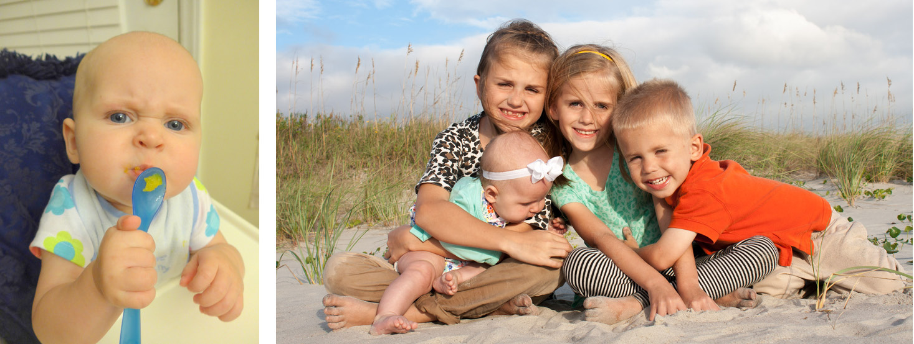

---
title: "Dissertation update 6"
author:
- name: Andrew Heiss
  affiliation: Duke University
  email: andrew.heiss@duke.edu
date: November 10, 2015
memo: True
to: "Judith Kelley, Tim Büthe, Timur Kuran, and Giovanna Merli"
...

Rejoice! Despite six months of radio silence, I am still alive!

# What I have done in the past six months (outside of the dissertation)

The past six months have been insanely busy, but life is finally more settled down (especially since our new baby has actually started to sleep at night). Here are the highlights:

* **Kids that never sleep**: Pictures of cute kids make any academic memo more exciting. We drove more than 4,000 miles across the country to Utah (and back). We went to the beach a couple times. We realized that four kids vastly outnumber two parents.

* **Institute for Qualitative and Multi-method Research (IQMR)**: I attended the two-week IQMR workshop at Syracuse in June and found it incredibly useful for (re)conceptualizing my theory in a more systematic way—I'm working on following the advice of Andy Bennett and David Waldner [@GeorgeBennett:2005; @BennettCheckel:2014a; @Waldner:2014] to create a clear typological theory and structure my case studies more coherently (the IQMR brainwashing worked :) )
* **Other research**: I had two non-dissertation-related articles accepted for publication: "Internal, Interactive, and Institutional Factors: Towards a Unified Theory of INGO Behavior" (with Tana Johnson) in *International Studies Review*, and "Nonprofit collaboration and the resurrection of market failure: How a resource sharing environment can suppress social objectives" (with Eva Witesman, my adviser at BYU) in *VOLUNTAS: International Journal of Voluntary and Nonprofit Organizations*. I published a book review last year, but this is the first time I've had peer-reviewed work make it all the way through the pipeline, which is exciting. I've also been working on an article on human trafficking NGOs with Judith.

# What I have done in the past six months (with my dissertation research)

Since it has been so long since many of you have heard about my research progress, it's probably helpful to summarize my argument and research design. International nongovernmental organizations (INGOs) play a critical role in global governance and international politics as they promote human rights and security. However, INGOs are influenced by the institutional environments of the countries they work in, and as a result, organizations working in dictatorships can inadvertently support repressive regimes. Using a novel dataset of INGO regulations and carefully conducted case studies of education and freedom of expression INGOs working in Egypt and China, I'm hoping to explain why and how dictators regulate INGOs and how INGOs respond to those regulations.

I'm testing four hypotheses, each forming a separate dissertation chapter:

> **H~1~**: When authoritarian regimes perceive themselves to be more stable, the *de jure* regulatory environment for INGOs will be less restrictive.

>> *H~1~ data*: Statistical analysis of INGO regulations in all authoritarian regimes since 1990 + historical process tracing of the *creation* of INGO legislation in Egypt and China

> **H~2~**: When the issue area an INGO works with is more aligned with the preferences and needs of a regime, the *de facto* implementation of the regulatory environment for INGOs will be less restrictive.

>> *H~2~ data*: Analysis of the *application* of INGO legislation in China (+ possible forays into looking at reported INGO restrictions worldwide using improved event data sources, maybe)

> **H~3~**: An INGO with ideal preferences that fall outside the allowable regulatory environment will face pressure to temper its programming  and become more compliant to regime demands.

> **H~4~**: When an INGO has more operational flexibility in its provision of services or advocacy, the organization's overlap with regime preferences will increase and the INGO will face fewer restrictions.

>> *H~3~ and H~4~ data*: Surveys of freedom of expression and education INGO sectors + interviews and fieldwork with INGOs

## New developments and risks for fieldwork

The phenomenon of authoritarian regimes restricting INGOs that deal with freedom of expression and education is certainly relevant today, further reinforcing the fact that "the idea that foreign-funded NGOs are a fifth column is one that autocrats find wonderfully convenient."^[See [http://www.economist.com/news/leaders/21661665-communist-party-wants-squeeze-civil-society-would-be-unwise-well](http://www.economist.com/news/leaders/21661665-communist-party-wants-squeeze-civil-society-would-be-unwise-well).] Over the past few months, both the Chinese and Egyptian regimes have become increasingly guarded and restrictive. In August, China announced new draft legislation that prohibits all Chinese NGOs from receiving foreign funding and establishes stricter rules for any foreign NGOs operating in the country. The law seems to be aimed at eliminating the legal grey area that allowed many politically motivated NGOs to operate, putting many INGOs at risk (including those I hope to interview).^[See [http://www.economist.com/news/leaders/21661665-communist-party-wants-squeeze-civil-society-would-be-unwise-well](http://www.economist.com/news/leaders/21661665-communist-party-wants-squeeze-civil-society-would-be-unwise-well) and [http://www.economist.com/news/china/21661819-new-draft-law-spooks-foreign-not-profit-groups-working-china-uncivil-society](http://www.economist.com/news/china/21661819-new-draft-law-spooks-foreign-not-profit-groups-working-china-uncivil-society).]

Similarly, INGO activism in Egypt has become even more dire in the past few months. In an interview with CNN's Wolf Blitzer at the end of September, President Sisi declared that there is "unprecedented freedom of expression in Egypt" and that journalists and activists are not muzzled by state regulations. However, a few weeks later, armed Egyptian police raided the offices of the Mada Foundation for Media Development—a Cairo-based INGO that helps with capacity building and training for journalists in the region—and arrested all staff members.^[See [https://www.amnesty.org/en/latest/news/2015/10/egypt-armed-raid-on-journalism-ngo-bears-hallmarks-of-another-assault-on-independent-media/](https://www.amnesty.org/en/latest/news/2015/10/egypt-armed-raid-on-journalism-ngo-bears-hallmarks-of-another-assault-on-independent-media/).] Earlier this week, the Egyptian military arrested journalist and activist Hossam Bahgat, but released him this morning following intense international pressure, including condemnation from the UN secretary-general Ban Ki-moon.^[See [http://www.madamasr.com/news/update-hossam-bahgat-has-been-released-unclear-if-charges-still-pending](http://www.madamasr.com/news/update-hossam-bahgat-has-been-released-unclear-if-charges-still-pending).]

As the environment for freedom of expression advocacy has worsened in Egypt, so too has my ability to travel there and interview activists. In the past few months, Egyptian authorities have begun targeting Western academics working with activists and NGO employees. For example, in July, Egyptian police deported a French MA student researching opposition political parties after raiding her hotel room.^[See [https://enlivenments.wordpress.com/2015/07/06/deportation-from-egypt-between-july-2-and-july-3rd-arrestation-et-expulsion-degypte-entre-le-2-juillet-et-le-3-juillet-2015/](https://enlivenments.wordpress.com/2015/07/06/deportation-from-egypt-between-july-2-and-july-3rd-arrestation-et-expulsion-degypte-entre-le-2-juillet-et-le-3-juillet-2015/).] Other scholars and journalists have faced similar government pressure, or in many instances, even harsher consequences—in May, Emad Shahin, a professor of public policy and political science at the American University of Cairo currently visiting Georgetown, was sentenced to death in absentia because he had studied and corresponded with members of the Muslim Brotherhood.^[See [http://www.al-fanarmedia.org/2015/05/prominent-egyptian-scholar-sentenced-to-death-in-absentia/](http://www.al-fanarmedia.org/2015/05/prominent-egyptian-scholar-sentenced-to-death-in-absentia/).] This increased scrutiny and repression has had a direct effect on the ability for anyone to research in the country, since "foreign scholars and local researchers alike… must pursue their scholarship in the region in the face of restrictions, suspicions and the chilling effect they all face."^[See [http://www.al-fanarmedia.org/2015/10/the-door-for-many-middle-east-scholars-is-slamming-shut/](http://www.al-fanarmedia.org/2015/10/the-door-for-many-middle-east-scholars-is-slamming-shut/).] In a series of e-mails, Ellen Lust—a scholar with a long history of researching NGOs and authoritarianism in Egypt—strongly discouraged me from attempting to do any in-country fieldwork, concluding that "it just isn't safe these days to do this."

Though I've been dissuaded against traveling to Egypt, I've received more positive feedback from scholars working on China issues (both at IQMR and in personal correspondence). Most believe that government officials will naturally be reticent and will not provide information that is entirely truthful or useful, but all feel that traveling to Beijing is perfectly safe.

## Current status

I've made good progress collecting the data for each of the four chapters/hypotheses, though much work remains. 

### H~1~ and H~2~: *De jure* and *de facto* INGO restrictions

I have been slowly working on compiling a comprehensive set of formal legal restrictions on INGOs in all authoritarian regimes since 1990s. To determine my current universe of regimes, I calculated the average of 1000 random draws of the Unified Democracy Score (UDS)^[[http://www.unified-democracy-scores.org/](http://www.unified-democracy-scores.org/).] for every country between 1990 and 2012 and selected countries with a score below zero. While this decision is relatively arbitrary, because it is based on Bayesian simulation it allows for countries on the edge of authoritarianism to drop out of the population, thus yielding 72 countries that are clearly less democratic (on average). I'm planning on tracking down all available records of formal INGO-related legislation for each of these countries, completing 3–4 per day beginning next Monday. Once I've collected each type of legislation, I will categorize and code the different laws (e.g. laws that restrict foreign funding, laws that dictate government involvement on governing boards, etc.). 

Last month, Judith introduced me to Suparna Chaudry, a PhD student at Yale working with Susan Hyde. Her dissertation—"The Assault on Democracy Assistance: Explaining State Repression of NGOs"—is *eerily* similar to mine. Just look at this: 

> This dissertation develops an argument for the conditions under which governments perceive NGOs as threatening their interests, and how NGOs working in different issue areas pose different forms of threat to the government. To test my argument, I undertake fieldwork in South Asia and conduct quantitative analysis of original datasets on state crackdown on international human rights NGOs from 1990-2005, repression of domestic and international election monitors that have observed elections in all developing countries from 1990-2013, and the overall nature of legal restrictions creating barriers to entry, funding and advocacy against NGOs in all developing countries from 1990-2013. I conclude by discussing the implications of this crackdown on the “taming” of democracy assistance, and how it may affect citizen perception of such groups.^[[https://sites.google.com/site/suparnachaudhry/research](https://sites.google.com/site/suparnachaudhry/research).]

We talked on Skype last week about our research, and fortunately our approaches differ in significant ways. She is looking at all types of regimes, not just dictatorships (her fieldwork is mostly based in India), and the NGOs she is researching deal with election monitoring (not education or freedom of expression). Rather than do all this similar work in isolation, we're trying to figure out how to appropriately join forces (similar to Judith's and Susan's work on election monitoring) and equitably share data. Our current plan is to write an article that answers a question we jointly have—this would allow us to justifiably share our data between ourselves (rather than just passing it to each other) *and* yield some foundational research with our new data. This world of studying (I)NGO restrictions is small, but growing, which is exciting.

### H~3~ and H~4~: INGO responses to restrictions

In order to conduct surveys of the two issue area sectors and conduct in-depth fieldwork with a select number of organizations, I had to first gather a complete database of INGOs in both sectors. Over the summer, I collected all information available in the Yearbook of International Organizations (YIO) and created a database of 1,170 freedom of expression INGOs and 2,902 education INGOs.^[In the process of collecting this data I inadvertently overloaded the YIO servers and cut off access to the database for all of Duke for a week. Oops.] These numbers are tentative, however—many of the organizations listed in the YIO are defunct and a number of the INGOs categorized as anti-censorship, journalism, media, and education organizations deal only tangentially with these issues or are not relevant to the types of advocacy or service provision I'm interested in (for example, I have data for the International Association of Philatelic Journalists (stamp collecting!), the International Ski Club of Journalists, the International Academy of Interdisciplinary Dentistry, and the Global Gambling Guidance Group, among others). I'm working on narrowing down these lists of NGOs to include only organizations that are relevant.

As I've been narrowing these lists, I've also been trying to expand them. Because the YIO has a limited definition of international organization, it excludes many organizations that work in only one foreign country—many education INGOs that work in China, for example, are based in the US and work in China alone, so they are excluded from the YIO. To expand the list, I've been using IssueCrawler, a service that takes a list of URLs, extracts all links on their pages, and follows those links to map out the connections between pages. If several organizations present in the YIO link to similar organizations that are unlisted, those unlisted INGOs should emerge in the IssueCrawler social network. While I have identified several new education INGOs using this approach, IssueCrawler failed to identify new freedom of expression organizations because of the nature of the sector and the nature of the method—INGOs that deal with journalism and censorship are more likely to be covered in the news, which means that the IssueCrawler social networks are dominated by news organizations like the BBC, CNN, and Reuters instead of actual advocacy organizations. I'm tinkering with IssueCrawler's settings to see if I can exclude the news media and better identify non-YIO organizations.

Once I have complete lists of INGOs, I will administer a survey to poll these organizations about their relationships with the host government, their knowledge of the legal environment, their experiences with *de facto* restrictions, and their flexibility in ideology and programming. I will also include a set of questions preceded by a framing vignette that presents the organization with a situation where they could hypothetically begin working in an authoritarian country. (Depending on sample size, I'd really like to make this an experimental condition, with vignettes that vary by regime time—half of respondents would be asked about entering a hypothetical democracy or autocracy.) 

I've made good progress selecting organizations to study more in depth. In my prospectus, I proposed randomly selecting a handful of organizations from each sector, but following the advice of Tim, Judith, and several panelists at IQMR, I have instead been more strategic in my organization case selection. Using the preliminary lists collected from the YIO, I looked for organizations that fit the following criteria:

* Works (or has worked) in, with, or regarding Egypt and China
* Is an NGO (and not a direct subsidiary of an IGO like UNICEF or UNESCO)
* Has some degree of potential contentiousness—that is,  it is not simply a friendly government-operated INGO (unlike several education INGOs I found that are operated by royal families in Qatar and the UAE)

Importantly, I did not consider office location (as I had originally intended)—it does not matter if the organization has its headquarters or branches in the country, since the choice to *not* have a physical presence in the country could reflect the organization's strategy of avoiding authoritarian restrictions.

After identifying organizations that met these criteria, I clustered INGOs based on purpose. Within the freedom of expression sector, three types of organizations appeared: advocacy, legal support, and training/capacity building. I selected the following organizations from each sector:

| Type                           | Organization                          | China and Egypt? | Location                  |
|--------------------------------|---------------------------------------|------------------|---------------------------|
| Advocacy                       | Article 19                            | Both             | London                    |
|                                | Index on Censorship                   | Both             | London                    |
| Legal support                  | Media Legal Defence Initiative (MLDI) | Both             | London                    |
| Training and capacity building | Internews                             | Both             | London and Washington, DC |
|                                | International Media Support (IMS)     | Both             | Copenhagen                |

Though the freedom of information issue area is based on an article of the Universal Declaration of Human Rights (article 19), it is not nearly as organized and consolidated as the education sector. Article 26 of the UDHR enshrines a universal right to education, and the UN’s second Millennium Development Goal (MDG) aims to achieve universal primary education worldwide. Prior to the 1990s, UNESCO, the World Bank, UNICEF, and other formal intergovernmental organizations (IGOs) led the EFA movement and framed education as an issue of international development. Starting in the 1990s, though, education INGOs took the lead in EFA efforts [@Mundy:2010; @ButheMajorMello-e-Souza:2012], though still under the umbrella of the Global Education First Initiative (GEFI), a joint effort of UNICEF and UNESCO. Coalitions of large INGOs including Oxfam International, ActionAid, Education International, and CARE International direct and fund much of the world's education advocacy, development, and provision.

Selecting organizations to use as case studies is a little trickier because of this tangled web of coalitions and partnerships in the education sector. I attempted to cluster organizations that (mostly) fit my criteria into three general categories: global advocacy and support, research and network hubs, and service provision. I selected the following organizations (and will expand it to include more on-the-ground service provision INGOs as I find them):

| Type                        | Organization                  | China and Egypt? | Location           |
|-----------------------------|-------------------------------|------------------|--------------------|
| Global advocacy and support | Save the Children             | Both             | London             |
|                             | Oxfam International           | Both             | London             |
|                             | World Education               | Both             | London             |
|                             | CARE International            | Egypt only       | London and Atlanta |
| Research + network hubs     | Global Campaign for Education | Both             | Johannesburg       |
|                             | Education International       | Both             | Brussels           |
| Service provision           | INCLUDED                      | China only       | Beijing            |
|                             | China CARE International      | China only       | Hong Kong          |
|                             | CARE International in Egypt   | Egypt only       | Cairo              |

Given the dangerous situation in Cairo and the fact that the majority of these organizations are based in London, I am planning trips to both London and Beijing in May. 

In London, I plan on scheduling and conducting dozens of interviews with INGO managers and staff on location. I will develop a semi-structured interview protocol and conduct the interviews over several days at each organization. Specifically, I will ask interviewees about their organizations' relationships with the host governments of the countries they work in, their knowledge of the legal environment for INGOs, their experiences with *de facto* restrictions, and their flexibility in ideology and programming. I will also closely read annual reports and press releases, and analyze public financial records to determine the relationship between these INGOs' flexibility and their response to the authoritarian regulatory environment.

In Beijing, I will conduct the same type of interviews with the handful of INGOs that are available. More importantly, I intend to meet with officials in the Chinese Ministry of Education, which has a history of collaborating with INGOs to promote and implement education initiatives—the UN's GEFI has labeled China as one of its "champion countries" because of these efforts.^[See [http://www.globaleducationfirst.org/china.html](http://www.globaleducationfirst.org/china.html)] As China's progress in education stands in contrast to their more dismal record of censorship and freedom of expression rights, I anticipate that Chinese government officials will be more willing to discuss their relationships with education INGOs than freedom of expression INGOs. I also plan to visit and interview scholars at Tsinghua University's NGO Research Center. Because I do not speak Chinese, I will hire a translator to assist with these interviews.

With the exception of CARE International and Oxfam International, no one (that I've found so far) has used any of these organizations for in-depth case study work in political science or international relations. In an ideal world, I'll be able to mimic Wendy Wong's treatment of Amnesty International [-@Wong:2012] and Sarah Stroup's treatment of CARE USA, Human Rights Watch, Oxfam, Amnesty, and Doctors Without Borders [-@Stroup:2012]. 

# Full tentative schedule

Here's my rough plan for finishing this whole project (again, very approximate dates):

# References
\setlength{\parindent}{-0.2in}
\setlength{\leftskip}{0.2in}
\setlength{\parskip}{0pt}
\vspace*{0in}
\noindent