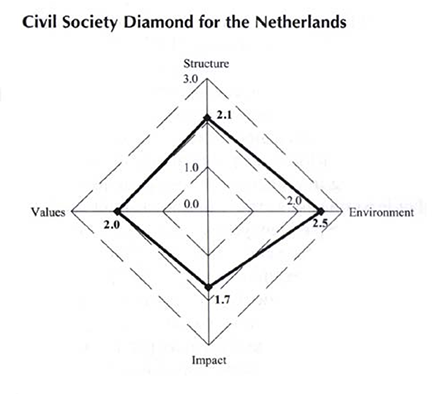

---
memo: True
title: "Landscape of NGO-related data"
author:
- name: Andrew Heiss
  affiliation: Duke University
  email: andrew.heiss@duke.edu
date: September 30, 2014
to: "Judith Kelley, Tim Büthe, and Timur Kuran"
...

As

Introduction, ¶ on what I'm studying

Difficult to measure, absence of rich data

# Identifying Civil Society Organizations

One difficulty in studying NGOs on a massive scale is that there is no comprehensive country-level or international list of organizations. My experience this past summer exemplifies this problem—Judith Kelley and her research assistants have compiled a list of NGOs that work with human trafficking, but after months of scouring the internet and contacting hundreds of these organizations, the list is still incomplete (even though it has over 1,000 organizations). 

Even if lists of NGOs do exist, they are unlikely to provide detailed information about the organizations, such as the issue areas they address or the countries they work in. Additionally, many NGOs may not actually be NGOs. Some can be operated by the government (GONGO), or be an office within a larger international organization, or just not exist anymore. 

Despite these issues, several useful lists compiled by various research centers can provide a good foundation for identifying NGOs. These lists (the Yearbook of International Organizations in particular) have become standard sources for (I)NGO identification in political science and international relations research.

## Yearbook of International Organizations

The Yearbook of International Organization (YIO)^[Available [http://www.uia.org/yearbook](http://www.uia.org/yearbook) (access through Duke)] is perhaps the most comprehensive list of all types of international organizations, with more than 67,000 organizations in nearly every country. It is updated annually. The YIO places organizations in a taxonomy of 15 categories,^[See [http://www.uia.be/types-organization-type-i](http://www.uia.be/types-organization-type-i)] of which four appear to apply to international NGOs: 

* Universal membership organizations (type B): 560 organizations that have 30–60+ member countries. Includes organizations such as Amnesty International, the World Young Women's Christian Association and SOS Children's Villages International.
* Organizations having a special form (type F): 5,515 organizations that are registered as foundations or special funds. Includes organizations such as Catholic Relief Services, the International Green Purchasing Network, and Asia Pacific Network of Sex Workers.
* Internationally-oriented national organizations (type G): 8,085 organizations that are based in a single country and work internationally. Includes organizations such as the European Policy Forum, Interfaith International, and Justice Africa.
* National organizations (type N): 3,426 organizations that are based in a single country with more limited international work. Includes organizations such as the International Centre for Corporate Social Responsibility, the International Human Rights Advocacy Centre, and the International Fancy Guppy Association.

Each entry in the encyclopedia can contain the following data, though not every entry has complete information:

* Contact information
* Subject
* Type I: one of 15 primary classifications, such as B, F, G, or N
* Type II: one of 13 secondary classifications, such as "bilateral (b)," "foundation or fund (f)," or "research institute (j)"
* Organization details: history, aims, structure, languages, staff, finances, consultative status, activities, publications
* Network details: members, relations with intergovernmental organizations, relations with nongovernmental organizations

The YIO approximates the organization's issue area with the subject field, which is algorithmically extracted from the organization's title and main objectives.^[Full taxonomy at [http://www.uia.be/yearbook-international-organizations-subject-categories](http://www.uia.be/yearbook-international-organizations-subject-categories)]. Searching by subject instead of type may be more useful for finding advocacy or humanitarian INGOs. For example, there are 1,904 organizations that focus on "Rights" and 4,473 that focus on "Societal Problems."

YIO provides links to download their data as CSV and XML files, which makes it easy to actually use their data.

## Encyclopedia of Associations

Similar to the YIO, Gale's Encyclopedia of Associations (EA)^[Access at [http://db.library.duke.edu/search?id=DUKE004055778](http://db.library.duke.edu/search?id=DUKE004055778)] contains a list of more than 31,000 international organizations and 125,000 US-based organizations (with international organizations based in the US cross listed). This directory is possibly too expansive—every branch of the organization is listed (for example, 100 Black Men of America is listed 59 times). 

Like the YIO, the EA categorizes its directory into distinct sections, including (most usefully for my research) "Public Affairs Organizations" and "Social Welfare Organizations." In contrast to the YIO, EA's taxonomy appears to be curated by humans and not algorithmically determined.

Each entry in the directory can contain the following data, though not every entry has complete information:

* Phone
* Email
* Website
* Year of foundation
* Description
* Section

This data is far less expansive than what is available in the YIO—the YIO is a fairly comprehensive database, while the EA acts more like a basic phonebook. 

Data can be exported from the EA, but is limited to 50–200 records at a time (depending on how it is exported). Exported data is e-mailed and takes a long time to actually get delivered. I'm actually still waiting for a test export.^[It will never, ever come.]

## UN-DESA

The UN's Department of Economic and Social Affairs (DESA)^[[http://csonet.org/](http://csonet.org/)] maintains a list of 3,900 NGOs that have consultative status with the UN's Economic and Social Council (ECOSOC). This list is literally just a list—a 125-page PDF with organization names and founding dates.^[[http://csonet.org/content/documents/e2013inf6.pdf](http://csonet.org/content/documents/e2013inf6.pdf)] 

UN-DESA also maintains a database of 31,000 NGOs that work with the UN,^[[http://esango.un.org/civilsociety/displayAdvancedSearch.do?method=search](http://esango.un.org/civilsociety/displayAdvancedSearch.do?method=search)] but the search function for the database is extremely clunky and limited. The database has an incomplete taxonomy, with categories focused primarily around Millennium Development Goals and organizational areas of expertise. Each entry contains only basic contact information and omits the organization's categorization. Additionally, there is no export function and the website is structured poorly, making scraping more difficult.

## Regional lists

Identifying domestic NGOs in authoritarian regimes poses unique challenges—few authoritarian governments (if any) make their lists of registered NGOs publicly available, and NGOs that aren't formally registered typically have an incentive to remain unregistered. Regional research institutes have attempted to collect lists of NGOs, with varying levels of completeness and comprehensiveness:

### The Arab Institute for Human Rights

The Arab Institute for Human Rights (AIHR)^[[http://aihr-resourcescenter.org/](http://aihr-resourcescenter.org/)] is based in Tunisia and provides data, resources, and other support for NGOs that work on democracy, transitional justice, and economic, social, and cultural rights in the Middle East and North Africa. AIHR currently has a list of 796 regional NGOs, including the Hisham Mubarak Law Center in Egypt, Jeunes sans Frontières in Tunisia, and The Jordan National Commission for Women. Each entry can contain the following information:

* Detailed contact information
* Type of organization
* Mission, goals, and strategies
* Activities

The website and all the data is in Arabic, but reading and translating are trivial. The website has no export function, but I can easily download it all with a web scraper (which I plan to do next week). 

### China Development Brief

China Development Brief (CDB)^[[http://www.chinadevelopmentbrief.cn/](http://www.chinadevelopmentbrief.cn/)] is based in Beijing and provides data, resources, and research on civil society and NGOs in China. Their directory of NGOs is far from comprehensive—CDB selected a subset of 251 independent grassroots NGOs and contacted them individually to collect their information. However, the information the CDB does have is impressively complete. Each entry contains the following information:

* Detailed contact information
* Sector
* Annual budget
* Activities in other countries
* Mission and goals
* Major projects and activities
* Funders and partners
* Statement of organizational distinctiveness

Data is available in Chinese and English and can be purchased online in report form. The raw data is unavailable for download, but can easily be collected with a web scraper. 

CDB provides additional data on Chinese NGOs, including a longer list of 1,953 local nonprofits^[In Chinese, [http://www.chinadevelopmentbrief.org.cn/service/action/org_search.php?org_type=1](http://www.chinadevelopmentbrief.org.cn/service/action/org_search.php?org_type=1). See also [http://www.hks.harvard.edu/centers/hauser/programs/past-programs/nonprofits-in-china](http://www.hks.harvard.edu/centers/hauser/programs/past-programs/nonprofits-in-china)]

# Measuring Civil Society Strength

Beyond measuring and identifying *individual actors* in domestic and global civil society, there have been some attempts at measuring the *nature* of civil society itself. However, an absence of regular updates and funding makes these data sources more difficult to use.

## CIVICUS Civil Society Index

The CIVICUS^[[http://civicus.org/](http://civicus.org/)] Civil Society Index Project (CSI)^[[http://www.civicus.org/csi/](http://www.civicus.org/csi/)] evaluates national civil society structure and values using country experts' opinions on four dimensions: (1) the *structure* of civil society, (2) the *external environment* in which civil society exists and functions, (3) the *values* practiced and promoted by civil society, and (4) the *impact* of activities pursued by civil society actors. Each dimension is scored on a 1–3 scale according to a set of sub dimensions and indicators (such as measures of charitable giving, amount of lobbying regarding social issues, or level of autonomy from the state). The scores for the four dimensions are then plotted as a diamond (see Figure 1)—countries with a larger spatial area ostensibly have a stronger civil society sector.

Previous work has used individual CSI dimensions (such as a country's external environment), the sums or means of the dimensions, or the total area of the diamond.

The first wave of CSI data was collected between 2003–06 in approximately 50 countries. A second wave was conducted in 2007–08, but limited to African nations. A third wave from 2008–09 used a revised methodology. Because of this, data collected in each of the waves is incomparable. Additionally, CSI data cannot be used in panel or longitudinal data, since it is only collected once per wave.

Recognizing that the CSI was too slow-moving to be useful for research, in 2012 CIVICUS announced the creation of an updated index: the CSI-Rapid Assessment project (CSI-RA). However, as of this memo, the CSI-RA has not collected data and remains stuck in its planning stages. 

## Global Civil Society Index

The Johns Hopkins Center for Civil Society Studies^[[http://ccss.jhu.edu/](http://ccss.jhu.edu/)] created a rival index in 2004 named the Global Civil Society Index (GCSI), based on data collected in 34 countries between 1995–2002.^[[http://ccss.jhu.edu/publications-findings?did=360](http://ccss.jhu.edu/publications-findings?did=360)] Similar to the CSI, the GCSI rates civil society strength along three dimensions: (1) the sector's *capacity*, size, and amount of effort, (2) the sector's resources for financial and strategic *sustainability*, and (3) the sector's social, economic, and political *impact*.

The GCSI has unfortunately not been updated since 2004 and is not especially useful for any longitudinal research. Additionally, it only covers a handful of non-OECD countries, which makes it unsuitable for studying civil society in authoritarian regimes.

## World Values Survey and Barometers

Public opinion surveys such as the World Values Survey (WVS)^[[http://www.worldvaluessurvey.org/](http://www.worldvaluessurvey.org/)] or regional projects like the Arab Barometer,^[[http://www.arabbarometer.org/](http://www.arabbarometer.org/)] Afrobarometer^[[http://www.afrobarometer.org/](http://www.afrobarometer.org/)], and Asian Barometer^[[http://www.asianbarometer.org/](http://www.asianbarometer.org/)] can provide insight into associational life that can be comparable to the apparently defunct CSI and GCSI indexes. These surveys do not collect data on organizations' budgets or funding sources or strategies, but they do measure individual-level trust, civic values, and engagement with government—all dimensions of civil society. 

These surveys are not conducted annually (the WVS is done every 5 years; regional barometers are done every 3–5 years), but they can give a somewhat more complete view of changes in public opinion over time and can potentially be used in longitudinal work. This survey data is not a perfect replacement for more detailed and specialized data on civil society strength, but can potentially provide a crude proxy for some more general aspects of a nation's civil society.

# Measuring Civil Society Activity

Measuring civil society activity is another difficult empirical hurdle. Recent advances in event data and text analysis methods may provide some tools for quantitatively measuring the activities of (I)NGOs. However, event data faces some powerful limitations (which can be overcome, to some degree)

## IDEA

## GDELT

## Open Event Data Alliance

## Other approaches

### Collection of specific text corpora

### Wikileaks

# Questions 

empirical questions that can be answered with the data, more data that needs to be found